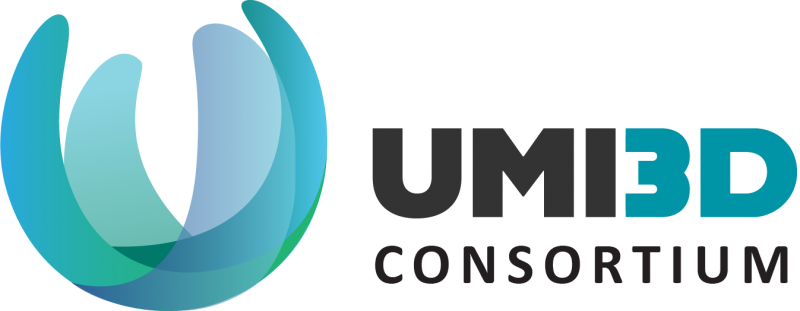

# UMI3D-SDK (Unity)

 

UMI3D is a web protocol that enables the creation of 3D media in which users of any AR/VR device can collaborate in real time. The 3D media is created once and hosted on a server or on a local computer. Any AR/VR device can display and interact with it remotely thanks to a dedicated UMI3D browser. 
<br>
For more information about UMI3D, visit the [UMI3D Consortium's website](https://umi3d-consortium.org)

---

### Version And Documentation

The Current UMI3D-SDK version is 2.3<br>
The documentation can be found [here](https://umi3d.github.io/UMI3D-SDK/index.html)<br>
The sdk is developed on unity version 2019.4.10f1 and tested on unity 2020.3.11f1 (See [Unity Archive](https://unity3d.com/fr/get-unity/download/archive)).

### UMI3D Browser & Samples

- [Virtual Worlds Samples](https://github.com/UMI3D/UMI3D-Samples)
- [UMI3D Desktop Browser](https://github.com/UMI3D/UMI3D-Desktop-Browser)
- [UMI3D SteamVR Browser](https://github.com/UMI3D/UMI3D-OpenVR-Browser)

### Unity Project Settings

- **File > Build Settings**: The architecture for Windows Standalone is x86_64.
- **Edit > Project Settings > Player > Other Settings**: Api compatibility Level is .NET 4.x

---
## Installation

### Installation through .unitypackage

- [UMI3D Virtual World Development Kit](https://github.com/UMI3D/UMI3D-SDK/releases/download/2.3.r.211112/edk.unitypackage)
- [UMI3D Browser Development Kit](https://github.com/UMI3D/UMI3D-SDK/releases/download/2.3.r.211112/cdk.unitypackage)

### Installation through Unity's Package Manager 

The minimum required unity version is (LTS) 2019.4 (See [Unity Archive](https://unity3d.com/fr/get-unity/download/archive)).

This method is only suited for **hight internet connection**.

Open Your project manifest ('.\Packages\manifest.json')

- For the **UMI3D Virtual World Development Kit** add the following lines at the top of the 'dependencies' array:
``` JSON
	"com.gfi-innovaton.umi3d.dependencies":"https://github.com/Gfi-Innovation/UMI3D-SDK.git?path=/UMI3D-SDK/Assets/Dependencies#2.3.r.211112",
	"com.gfi-innovaton.umi3d.common.core":"https://github.com/Gfi-Innovation/UMI3D-SDK.git?path=/UMI3D-SDK/Assets/Common/Core#2.3.r.211112",
	"com.gfi-innovaton.umi3d.common.interaction-system":"https://github.com/Gfi-Innovation/UMI3D-SDK.git?path=/UMI3D-SDK/Assets/Common/InteractionSystem#2.3.r.211112",
	"com.gfi-innovaton.umi3d.common.user-capture":"https://github.com/Gfi-Innovation/UMI3D-SDK.git?path=/UMI3D-SDK/Assets/Common/UserCapture#2.3.r.211112",
	"com.gfi-innovaton.umi3d.common.collaboration":"https://github.com/Gfi-Innovation/UMI3D-SDK.git?path=/UMI3D-SDK/Assets/Common/Collaboration#2.3.r.211112",
	"com.gfi-innovaton.umi3d.edk.core":"https://github.com/Gfi-Innovation/UMI3D-SDK.git?path=/UMI3D-SDK/Assets/EnvironmentDevelopmentKit/Core#2.3.r.211112",
	"com.gfi-innovaton.umi3d.edk.interaction-system":"https://github.com/Gfi-Innovation/UMI3D-SDK.git?path=/UMI3D-SDK/Assets/EnvironmentDevelopmentKit/InteractionSystem#2.3.r.211112",
	"com.gfi-innovaton.umi3d.edk.user-capture":"https://github.com/Gfi-Innovation/UMI3D-SDK.git?path=/UMI3D-SDK/Assets/EnvironmentDevelopmentKit/UserCapture#2.3.r.211112",
	"com.gfi-innovaton.umi3d.edk.collaboration":"https://github.com/Gfi-Innovation/UMI3D-SDK.git?path=/UMI3D-SDK/Assets/EnvironmentDevelopmentKit/Collaboration#2.3.r.211112",
```
- For the **UMI3D Browser Development Kit** add the following lines at the top of the 'dependencies' array:
``` JSON
	"com.gfi-innovaton.umi3d.dependencies":"https://github.com/Gfi-Innovation/UMI3D-SDK.git?path=/UMI3D-SDK/Assets/Dependencies#2.3.r.211112",
	"com.gfi-innovaton.umi3d.common.core":"https://github.com/Gfi-Innovation/UMI3D-SDK.git?path=/UMI3D-SDK/Assets/Common/Core#2.3.r.211112",
	"com.gfi-innovaton.umi3d.common.interaction-system":"https://github.com/Gfi-Innovation/UMI3D-SDK.git?path=/UMI3D-SDK/Assets/Common/InteractionSystem#2.3.r.211112",
	"com.gfi-innovaton.umi3d.common.user-capture":"https://github.com/Gfi-Innovation/UMI3D-SDK.git?path=/UMI3D-SDK/Assets/Common/UserCapture#2.3.r.211112",
	"com.gfi-innovaton.umi3d.common.collaboration":"https://github.com/Gfi-Innovation/UMI3D-SDK.git?path=/UMI3D-SDK/Assets/Common/Collaboration#2.3.r.211112",
	"com.gfi-innovaton.umi3d.cdk.core":"https://github.com/Gfi-Innovation/UMI3D-SDK.git?path=/UMI3D-SDK/Assets/ClientDevelopmentKit/Core#2.3.r.211112",
	"com.gfi-innovaton.umi3d.cdk.interaction-system":"https://github.com/Gfi-Innovation/UMI3D-SDK.git?path=/UMI3D-SDK/Assets/ClientDevelopmentKit/InteractionSystem#2.3.r.211112",
	"com.gfi-innovaton.umi3d.cdk.user-capture":"https://github.com/Gfi-Innovation/UMI3D-SDK.git?path=/UMI3D-SDK/Assets/ClientDevelopmentKit/UserCapture#2.3.r.211112",
	"com.gfi-innovaton.umi3d.cdk.collaboration":"https://github.com/Gfi-Innovation/UMI3D-SDK.git?path=/UMI3D-SDK/Assets/ClientDevelopmentKit/Collaboration#2.3.r.211112",
```
The tag (#2.3.r.211112) can be set to any branch or tag on the sdk repo. Example: '#master', '#development', '#2.1.b.210104'

To activate the intelsence of UMI3D-SDK in Visual Studio 2019, navigate to the menu :
- **Edit > Preferences > External Tools** and check the option **Git packages**. It will be necesary to regenerate the project files.


